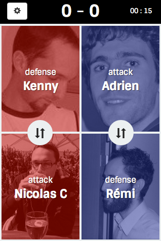

# Babitch Client [](https://travis-ci.org/M6Web/BabitchClient)

Many companies all over the world uses babyfoot to build team spirit. BabitchClient is a project based on the [Babitch Api](https://github.com/M6Web/Babitch) to record all your babyfoot games.

BabitchClient provides a simple responsive user interface.



## Features

* 2VS2
* Attacker/Defender Goal
* Own goal support
* Cancel last goal
* Switch table side
* Gravatar support
* Lot of Stats by players and team

## Installation

### Clone the project

```
$ git clone https://github.com/M6Web/BabitchClient.git
$ cd BabitchClient
$ cp app/scripts/config.js.dist app/scripts/config.js
```

### For production purposes
* Install the Babitch Server API => [M6Web/Babitch](https://github.com/M6Web/Babitch)
* Go to app/scripts/config.js and change server config

```
$ bower install
$ grunt build
```

Then,

* Configure a Web Server (Apache/Nginx/...) with the `dist` folder as the doc root
* Launch `<yourwebserver.com>/` in a browser

### For dev purposes
```
$ npm install
$ bower install
$ grunt serve
```
Then go to `http://127.0.0.1:8080/`,

You have two options for the server side :

* Install the Babitch Server API => [M6Web/Babitch](https://github.com/M6Web/Babitch) and change `app/scripts/config.js`
* Use the faked backend by adding `?nobackend` to the BabitchClient url

#### Test (Unit & E2E)

Only unit test :
* `grunt test-unit`

Only E2E test :
* `grunt test-e2e`

All test :
* `grunt test`

## Live

You need to configure `BABITCH_LIVE_FAYE_URL` and `BABITCH_LIVE_FAYE_CHANNEL` in `app/scripts/config.js`

* User interface : `http://127.0.0.1:8080/#live`

## Technical Stack

* Yeoman, to boostrap the application
* Angular.Js
* Grunt, for development server and automation
* Karma, Protractor and PhantomJs, for testing
* Faye for realtime messaging
* D3.js for data visualization

## Docker
To use Docker as simple user (logout after this command):

    sudo usermod -aG docker $USER
    
To build the Docker image, just clone and run:

    docker build -t m6web-babitch-client .

Then run the container:

    docker run --name m6web-babitch-client -p 8000:80 m6web-babitch-client

You now have a BabitchClient listening on port `8000`!

## Credits

Developped by [M6 Web](http://tech.m6web.fr/).

## License

Babitch is licensed under the [MIT license](LICENSE).
